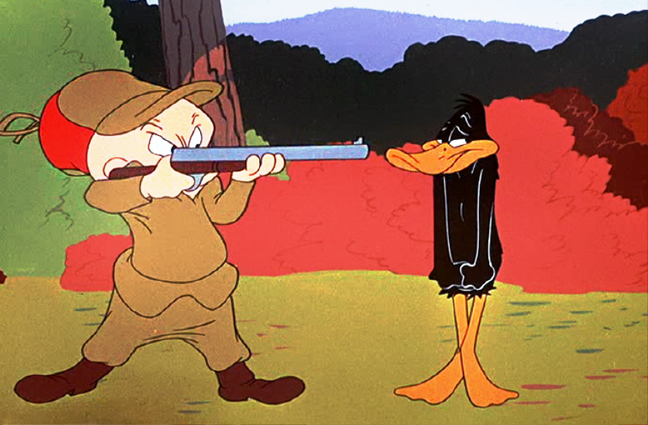
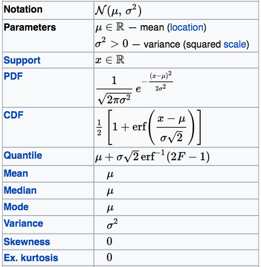

\huge{PART 1}

\LARGE

Probability theory from scratch


```{r setup, echo = FALSE}
library(graphicsutils)
myblue <- "#7eb6d6"
myred <- "#e080a3"
mygreen <- "#d4e09b"
mygrey <- "grey35"
mypar <- list(fg=mygrey, col.lab=mygrey, col.axis=mygrey, bg="transparent", las = 1, cex.main=2, cex.axis=1.4, cex.lab=1.4, bty="l")
```


# A few notes on History

Chevalier de Méré (1607-1684), Pascal (1623-1662) and Fermat (1607-1665):
\pause

- de Méré: wit / courtier (Louis XIV) brought Pascal's attention to 2 problems
(1650-1655):

\pause

  1. dice problem   
  2. division problem (problèmes des parties)
\pause

  - Pascal solved the hardest problem (correspondence with Fermat)


# A few notes on History

- **dice problem**:

\pause

> "When one throws with two dice, how many throws must one be allowed in order
to have a better than even chance of getting two sixes at least once?"

\pause

- **division problem**:

\pause

> "An elderly nobleman, staying at his country house, was extremely fond of
watching ball games, and so he called in two young farmhands, saying, 'Here are
four ducats for which you may play; the one who first takes eight games is the
winner.' So they began to play, but when one had five games and the other
three games, they lost the ball and were unable to finish. The question is how
the prize should be divided."

\small Ore, O. Pascal and the Invention of Probability Theory (1960).


# A few notes on History

- Reverend Thomas Bayes (1701 – 1761) *An Essay Towards Solving a Problem in the Doctrine of Chances* (published posthumously)
\pause

- Pierre-Simon Laplace (1749–1827) *Théorie Analytique des Probabilités in 1812*

\pause

- Huygens, de Moivre, Galton, Gauss, von Mises, Kolmogorov, Neyman, Wiener,
Wald, Pearson, Shannon, Fisher.


# References

1. [Hacking I., The Emergence of Probability (2006).](https://books.google.ca/books?id=ewqzOGDKYscC&dq=emergence+of+probabilities&hl=fr&source=gbs_navlinks_s)

\pause

2. [Hendricks V. F., Pedersen S. A., Jørgensen K. F. , Probability Theory Philosophy, Recent History and Relations to Science (2001). ](https://books.google.ca/books/about/Probability_Theory.html?id=E5-yAqDhmY8C&redir_esc=y)

\pause

3. [Brémaud P., An Introduction to Probability Modelling (1988). ](https://books.google.ca/books/about/An_Introduction_to_Probabilistic_Modelin.html?hl=de&id=wF5dg0UUXRIC&redir_esc=y)


# Examples

- Allesina and Tang, **Stability criteria for complex ecosystems**,
*Nature* (2012), \pause based on Tao, Vu & Krishnapur, **Random matrices:
Universality of ESDs and the circular law**, *The Annals of Probability* (2010).

\pause

- Population genetics: a population = probability distribution of traits (random variables)

\pause

- Expending the classical TIB!


# Probability space


\begin{large}
Let's flip a coin \pause and define $\left(\Omega, \mathcal{F}, P\right)$
\end{large}


\pause

1. $\Omega$: Sample space, *i.e.* set of all possible outcomes  

\begin{itemize}
     \item<6-8> "Head" "Tail"
\end{itemize}  

\pause

2. $\mathcal{F}$: set of events *i.e.* combinations of outcomes ($\sigma$-field)

\begin{itemize}
     \item<7-8> $\emptyset$, "Head", "Tail", "Head or Tail" ($\Omega$)
\end{itemize}   

\pause

3. $P$: maps events occurrence into [0,1]

\begin{itemize}
     \item<8-8> \alert<6>{$P(\emptyset)=0$};  $P("Head") = p$;  $P("Tail") = 1-p$; \alert<6>{$P(\Omega) = 1$}
 \end{itemize}  


# Probability space

\begin{large}
Occurrence of species 1 on an island:
\end{large}

\pause


1. $\Omega$: Sample space set of all possible outcomes  

\begin{itemize}
     \item<2-4>  {"Present" or "1", "Absent" or "0"}
 \end{itemize}  

\pause

2. $\mathcal{F}$: set of events *i.e.* 0 or more outcomes

\begin{itemize}
     \item<3-4> $\emptyset$, "0", "1", "1 or 0" ($\Omega$)
 \end{itemize}   

\pause

3. $P$: assign a probability / map events occurrence into [0,1]

\begin{itemize}
     \item<4-4> $P(\emptyset)=0$;  $P("1") = p$;  $P("0") = 1-p$; $P(\Omega) = 1$
 \end{itemize}  


# Probability space

\begin{large}
  Occurrence of species 1 and species 2 on an island
\end{large}

\pause

1. $\Omega$: {"00", "01", "10", "11"}

\pause

2. $\mathcal{F}$: $\emptyset$, $\Omega$, "01", "at least one species"

\pause

3. $P$: $p_{00}$, $p_{01}$, ...


# Combining events

\large

Let "A" and "B" denotes two distinct events:

\pause

1. $A \cup B$: "A or B"
\pause

2. $A \cap B$: "A and B"
\pause

3. $\overline{A}$: "complement of A"
\pause

NB: $A \cup \overline{A} = \Omega$ and $A \cap \overline{A} = \emptyset$

\pause

NB: $P(\overline{A}) = 1 = P(A)$


# Combining events

```{r omega, echo = FALSE, fig.width=6, fig.height=4.5}
par(xaxs="i", yaxs="i")
plot0(c(0,1), fill=myblue)
text(.9,.1, label=expression(Omega), cex=2.6, col=mygrey)
box2(1:4, col=mygrey)
```

\LARGE $P(\Omega) = 1$


# Combining events

```{r emptySet, echo = FALSE, fig.width=6, fig.height=4.5}
##---
par(xaxs="i", yaxs="i")
plot0(c(0,1))
text(.9,.1, label=expression(bar(Omega)), cex=2.6, col=mygrey)
box2(1:4, col=mygrey)
```

\LARGE $P(\overline{\Omega}) = P(\emptyset) = 1 - P(\Omega) = 0$


# Combining events

```{r eventA, echo = FALSE, fig.width=6, fig.height=4.5}
rc1 <- c(.2,.4,.6,.8)
rc2 <-  c(.4,.2,.8,.6)
##---
par(xaxs="i", yaxs="i")
plot0(c(0,1))
rect(rc1[1], rc1[2], rc1[3], rc1[4], col = myblue, border=NA)
text(mean(rc1[c(1,3)]), mean(rc1[c(2,4)]), label="A", cex=2.6, col=mygrey)
box2(1:4, col=mygrey)
```

\LARGE $P(A)$


# Combining events

```{r complement, echo = FALSE, fig.width=6, fig.height=4.5}
par(xaxs="i", yaxs="i")
plot0(c(0,1), fill=myblue)
rect(rc1[1], rc1[2], rc1[3], rc1[4], col = "white", border=NA)
box2(1:4, col=mygrey)
text(.9,.1, label=expression(bar(A)), cex=2.6, col=mygrey)
```

\LARGE $P(\overline{A}) = 1 - P(A)$


# Combining events


```{r eventB, echo = FALSE, fig.width=6, fig.height=4.5}
par(xaxs="i", yaxs="i")
plot0(c(0,1))
rect(rc2[1], rc2[2], rc2[3], rc2[4], col = myblue, border=NA)
text(mean(rc2[c(1,3)]), mean(rc2[c(2,4)]), label="B", cex=2.6, col=mygrey)
box2(1:4, col=mygrey)
```

\LARGE $P(B)$


# Combining events

```{r interAB, echo = FALSE}
par(xaxs="i", yaxs="i")
plot0(c(0,1))
rect(rc1[1], rc1[2], rc1[3], rc1[4], col = NA, border=mygrey, lwd=.4)
rect(rc2[1], rc2[2], rc2[3], rc2[4], col = NA, border=mygrey, lwd=.4)
rect(rc2[1], rc1[2], rc1[3], rc2[4], col = myblue, border=NA)
text(.5*(rc2[1]+rc1[3]) , .5*(rc1[2]+rc2[4]), label= expression(A~intersect(B)), cex=2.6, col=mygrey)
box2(1:4, col=mygrey)
```

\LARGE $P(A \bigcap B) = \alert{?}$


<!-- we assume this is known we'll come back latter on that -->


# Combining events


```{r eventAB, echo = FALSE, fig.width=6, fig.height=4.5}
par(xaxs="i", yaxs="i")
plot0(c(0,1))
rect(rc1[1], rc1[2], rc1[3], rc1[4], col = myblue, border=NA)
rect(rc2[1], rc2[2], rc2[3], rc2[4], col = myblue, border=NA)
text(mean(rc2[c(1,3)])-.1, mean(rc2[c(2,4)])+.1, label= expression(A~union(B)), cex=2.6, col=mygrey)
box2(1:4, col=mygrey)
```

\LARGE $P(A \bigcup B) = P(A) + P(B) - P(A \bigcap B)$


# Combining events

```{r complementAB, echo = FALSE}
par(xaxs="i", yaxs="i")
plot0(c(0,1), fill=myblue)
rect(rc1[1], rc1[2], rc1[3], rc1[4], col = "white", border=NA)
rect(rc2[1], rc2[2], rc2[3], rc2[4], col = "white", border=NA)
text(.85, .1, label= expression(bar(A~union(B))), cex=2.6, col=mygrey)
box2(1:4, col=mygrey)
```

\LARGE $P(\overline{A \cup B}) = 1 - P(A \cup B)$


# Combining events

```{r interAcomplB, echo = FALSE}
par(xaxs="i", yaxs="i")
plot0(c(0,1))
rect(rc2[1], rc2[2], rc2[3], rc2[4], col = myblue, border=NA, lwd=.4)
rect(rc1[1], rc1[2], rc1[3], rc1[4], col = "white", border = mygrey, lwd=.4)
rect(rc2[1], rc2[2], rc2[3], rc2[4], col = NA, border=mygrey, lwd=.4)

text(.5*(rc2[1]+rc2[3]), .5*(rc2[2]+rc2[4])-.1, label= expression(bar(A)~intersect(B)), cex=2.6, col=mygrey)
box2(1:4, col=mygrey)
```

\LARGE $P(\overline{A} \cap B) = P(B) - P(A \cap B)$


# Combining events - disjoint events

```{r disjoint, echo = FALSE}
par(xaxs="i", yaxs="i")
plot0(c(0,1))
rect(rc1[1]-.1, rc1[2], rc1[3]-.1, rc1[4], col = myblue, border=mygrey)
rect(rc2[1]+.1, rc2[2], rc2[3]+.1, rc2[4], col = myblue, border=mygrey)
text(mean(rc1[c(1,3)])-.1, mean(rc1[c(2,4)]), label="A", cex=2.6, col=mygrey)
text(mean(rc2[c(1,3)])+.1, mean(rc2[c(2,4)]), label="B", cex=2.6, col=mygrey)
box2(1:4, col=mygrey)
```

\LARGE $A \cap B = \emptyset$;  $P(A \cap B) = 0$


# Combining events - partition

\large

Consider $B$ \pause and $A_i$ where i $\in$ \{1,...,n\}:

\pause

1. $\forall$ \{i, j\} \\ $i \neq j$, $P(A_i \cap A_j) = 0~~$ **pairwise disjoint**

\pause

2. $\bigcap_i^n A_i = B$ $\Rightarrow$ $\sum_i^n P(A_i) = P(B)$

\pause

then, the set $A_i$ is a **partition** of $B$.


# Combining events - partition

```{r partition1, echo = FALSE}
par(xaxs="i", yaxs="i")
plot0(c(0,1))
rect(rc2[1]+.1, rc2[2], rc2[3]+.1, rc2[4], col = myblue, border=mygrey)
text(mean(rc2[c(1,3)])+.1, mean(rc2[c(2,4)]), label="B", cex=2.6, col=mygrey)
box2(1:4, col=mygrey)
```


# Combining events - partition

```{r partition2, echo = FALSE}
par(xaxs="i", yaxs="i")
plot0(c(0,1))
rect(rc2[1]+.1, rc2[2], rc2[1]+.25, rc2[4], col = myblue, border=mygrey)
rect(rc2[1]+.25, rc2[2], rc2[1]+.4, rc2[4], col = darken(myblue, 25), border=mygrey)
rect(rc2[1]+.4, rc2[2], rc2[3]+.1, rc2[4], col = darken(myblue, 50), border=mygrey)
text(c(.58,.73,.85), rep(mean(rc2[c(2,4)]), 3), label=c("A1", "A2", "A3"), cex=2.6, col="white")
box2(1:4, col=mygrey)
```


\LARGE $P(B) = P(A_1 \cup A_2 \cup A_3) \pause = P(A_1) + P(A_2) + P(A_3)$


# Combining events - partition

```{r partition3, echo = FALSE, fig.width=6.5, fig.height=4.5}
layout(matrix(c(1,1,2,3,4,4,3,5,5),3,3))
par(xaxs="i", yaxs="i", mar=c(0,0,0,0))
for (i in 1:5){
  plot0(c(-1,1), c(-1,1), fill=darken(myblue, 12*(i-1)+1))
  text(0,0, paste0("A",i), cex=2.8, col="white")
}
```


# Combining events - partition

\large

$A_i$ where $i \in \{1, 2, 3, 4, 5\}$ is a partition of $\Omega$

$$\sum_i^5 P(A_i) = 1$$


# Combining events - formula (law) of total probability

\large

$A_i$ a partition of $\Omega$ and B an event:

$$P(B) = \sum_i^n P(B \cap A_i)$$


# Combining events - formula (law) of total probability

```{r partition4, echo = FALSE, fig.width=6.5, fig.height=4.5}
layout(matrix(c(1,1,2,3,4,4,3,5,5),3,3))
par(xaxs="i", yaxs="i", mar=c(0,0,0,0))
for (i in 1:5){
  plot0(c(-1,1), c(-1,1), fill=darken(myblue, 12*(i-1)+1))
  text(0,0, paste0("A",i), cex=2.8, col="white")
}
box2(1:4, col=mygrey, which = 'outer')
par(new = T, fig = c(0.2, .4, .1, .8))
plot0(fill="#CCCCCCCC")
text(0,0, "B", col="white", cex=2.8)
```


# Combining events - formula (law) of total probability

\large

$A_i$ where $i \in \{1, 2, 3, 4, 5\}$ is a partition of $\Omega$

$$P(B) = \sum_i^5 P(B \cap A_i)$$


# Occurrence of species 1 and species 2 on an island

\large

- Events: \{"00", "01", "10", "11"\}

\pause

- $P("00" \cap "01") = 0$

\pause

- $"00" \cup "01" \cup "10" \cup "11" = \Omega$

\pause

- \{"00", "01", "10", "11"\} is a partition of $\Omega$

\pause

- $p_{00}$ + $p_{01}$ + $p_{10}$ + $p_{11}$ = 1


# Occurrence of species 1 and species 2 on an island

- "00", "01", "10", "11" are **singleton sets** (a.k.a unit sets)

\pause

- \{"00", "01", "10", "11"\} a partition of $\Omega$ made of singleton sets

\pause

-  $p_{00}$, $p_{01}$, $p_{10}$, $p_{11}$

\pause

\vspace{.5cm}

Describes a **probability distribution**


<!-- 20 min  -->

# Let's practice 1 (15 min)

\begin{exampleblock}{PRACTICE 1}
  \begin{itemize}
      \item<1-4> $P(A \cup B \cup C)$
      \item<2-4> the duck hunter 1 bullet
      \item<3-4> the duck hunter 2 bullets / 2 ducks - 1 duck
      \item<4-4> \alert{bonus}: how to simulate a dice with a coin?
  \end{itemize}    
\end{exampleblock}


# Let's practice 1 - $P(A \bigcup B \bigcup C)$

```{r eventABC, echo = FALSE}
par(xaxs="i", yaxs="i")
plot0(c(0,1))
##--
rect(rc2[1]+.1, rc2[2]+.1, rc2[3]+.1, rc2[4]+.1, col = myblue, border = NA, lwd=.4)
rect(rc1[1]+.1, rc1[2]+.1, rc1[3]+.1, rc1[4]+.1, col = myblue, border = NA, lwd=.4)
rect(rc2[1]-.15, rc2[2]-.05, rc2[3]-.15, rc2[4]-.05, col = myblue, border = NA, lwd=.4)
##--
rect(rc2[1]+.1, rc2[2]+.1, rc2[3]+.1, rc2[4]+.1, col = NA, border = mygrey, lwd=.4)
rect(rc1[1]+.1, rc1[2]+.1, rc1[3]+.1, rc1[4]+.1, col = NA, border = mygrey, lwd=.4)
rect(rc2[1]-.15, rc2[2]-.05, rc2[3]-.15, rc2[4]-.05, col = NA, border = mygrey, lwd=.4)
##--
text(c(.35,.8,.3), c(.8,.5,.2), labels=LETTERS[1:3], col=mygrey, cex=2)
box2(1:4, col=mygrey)
```

\LARGE $P(A \bigcup B \bigcup C) = ?$


# Let's practice 1 - Elmer, the duck hunter

{width=50%}

\vspace{-.5cm}

- Elmer, one bullet, one duck

- Elmer, two bullets, two ducks

- Elmer, two bullets, one duck


# Solution 1 - $P(A \bigcup B \bigcup C)$

```{r eventABCs, echo = FALSE}
par(xaxs="i", yaxs="i")
plot0(c(0,1))
##--
rect(rc2[1]+.1, rc2[2]+.1, rc2[3]+.1, rc2[4]+.1, col = paste0(myblue, "88"), border = NA, lwd=.4)
rect(rc1[1]+.1, rc1[2]+.1, rc1[3]+.1, rc1[4]+.1, col = paste0(myblue, "88"), border = NA, lwd=.4)
rect(rc2[1]-.15, rc2[2]-.05, rc2[3]-.15, rc2[4]-.05, col = paste0(myblue, "88"), border = NA, lwd=.4)
##--
rect(rc2[1]+.1, rc2[2]+.1, rc2[3]+.1, rc2[4]+.1, col = NA, border = mygrey, lwd=.4)
rect(rc1[1]+.1, rc1[2]+.1, rc1[3]+.1, rc1[4]+.1, col = NA, border = mygrey, lwd=.4)
rect(rc2[1]-.15, rc2[2]-.05, rc2[3]-.15, rc2[4]-.05, col = NA, border = mygrey, lwd=.4)
##--
text(c(.35,.8,.3), c(.8,.5,.2), labels=LETTERS[1:3], col=mygrey, cex=2)
box2(1:4, col=mygrey)
```

$$P(A \cup B \cup C) = P(A) + P(B) + P(C) - P(A \cap B) - P(A \cap C) - P(C \cap B) + P(C \cap B \cap A)$$


# Solution 1 - $P(A \bigcup B \bigcup C)$

 - See the [Inclusion–exclusion principle](https://en.wikipedia.org/wiki/Inclusion–exclusion_principle) article on wikipedia (formule du crible de Poincaré).


# Solution 1 - the duck paradigm

- Elmer, one bullet, one duck

  - "sucess" ("1")/ "failure" ("0")
  - $P("sucess") = p$ ; $P("failure") = 1-p$

\pause

- Elmer, two bullets, two ducks / one duck
\pause

  - {"00", "01", "10", "11"}
\pause

  - two ducks: $p_{00}$, $p_{01}$, $p_{10}$, $p{11}$
\pause

  - two ducks: $p_{00}$, $p_{01}$, $p_{10}$, $p{11}$


# Random variables

- Flipping a coin / occurrence of 1 species on an island / shooting a duck
\pause $\rightarrow$ we apply a similar probabilistic approach.  


\pause

- *Success*: "Head", "Presence", "one dead duck" $\rightarrow$ **1**

\pause

- *Failure*: "Tails", "Absence", "no dinner tonight" $\rightarrow$ **0**

\pause

- Now let $X$ denote a variable such as:
    - $X=1$ success: $P(X) = p$ ;
    - $X=0$ failure: $P(\overline{X}) = 1- p$

\pause

- Define a random variable + assign a probability distribution.


# Random variables and probability distribution

- A **random variable** $X: \Omega \rightarrow M$ where M is a measurable
space (natural numbers, real numbers, ...)

\pause

- A **probability distribution** \alert{$f$} is a function that assigns probability
under certain constraints:
\pause

  1. $f$ specifies $P$ for the partition of $\Omega$ made of singletons  
\pause

  2. $f$ defines $p_{0}$, $p_{1}$, $p_{2}$, ..., $p_{n}$ such as $\sum p_i = 1$
\pause

    - Coin $P("Head") = P(1) = p$; $P("Tail") = P(0) = 1-p$
\pause

    - Dice $P(1)=P(2)=...=P(6)=\frac{1}{6}$

<!-- choices we made -->


# Independence - Intuition

```{r tree1, echo = FALSE, fig.width=7, fig.height=4.5}
cexx <- 1.6
par(xaxs="i", yaxs="i")
plot0(c(0,1), c(0,1.1))
arrows(.15, .5, .4, .75, col=mygrey, lwd = 2)
arrows(.15, .5, .4, .25, col=mygrey, lwd = 2)
## --
text(c(.4), c(.75), labels = expression(X), pos = 4, cex=cexx, col=mygrey)
text(c(.4), c(.25), labels = expression(bar(X)), pos = 4, cex=cexx, col=mygrey)
## --
text(c(.25), c(.68), labels = "p", cex=1.4, col=myblue)
text(c(.25), c(.32), labels = "1-p", cex=1.4, col=myblue)
## --
text(.25, 1.04, "SHOOT 1", col=mygreen)
```


# Independence - Intuition - 2 ducks

```{r tree2, echo = FALSE, fig.width=7, fig.height=4.5}
par(xaxs="i", yaxs="i")
plot0(c(0,1), c(0,1.1))
arrows(.15, .5, .4, .75, col=mygrey, lwd = 2)
arrows(.15, .5, .4, .25, col=mygrey, lwd = 2)
## --
text(.4, .75, labels = expression(X[1]), pos = 4, cex=cexx, col=mygrey)
text(.7, .9, labels = expression(X[2]), pos = 4, cex=cexx, col=mygrey)
text(.7, .4, labels = expression(X[2]), pos = 4, cex=cexx, col=mygrey)
#
text(.4, .25, labels = expression(bar(X[1])), pos = 4, cex=cexx, col=mygrey)
text(.7, .6, labels = expression(bar(X[2])), pos = 4, cex=cexx, col=mygrey)
text(.7, .1, labels = expression(bar(X[2])), pos = 4, cex=cexx, col=mygrey)
## --
text(c(.25, .55, .55), c(.68, .88, .42), labels = "p", cex=1.4, col=myblue)
text(c(.25, .55, .55), c(.32, .1, .6), labels = "1-p", cex=1.4, col=myblue)
## --
text(.25, 1.04, "SHOOT 1", col=mygreen)
text(.55, 1.04, "SHOOT 2", col=mygreen)
## --
y2 <- c(.9, .6, .4, .1)
for (i in y2) arrows(.47, .25+(i>.5)*.5, .7, i, col=mygrey, lwd = 2)
## --
```


# Independence - Intuition - 2 ducks

```{r tree2b, echo = FALSE, fig.width=7, fig.height=4.5}
par(xaxs="i", yaxs="i")
plot0(c(0,1), c(0,1.1))
arrows(.15, .5, .4, .75, col=mygrey, lwd = 2)
arrows(.15, .5, .4, .25, col=mygrey, lwd = 2)
## --
text(.4, .75, labels = expression(X[1]), pos = 4, cex=cexx, col=mygrey)
text(.7, .9, labels = expression(X[2]), pos = 4, cex=cexx, col=mygrey)
text(.7, .4, labels = expression(X[2]), pos = 4, cex=cexx, col=mygrey)
#
text(.4, .25, labels = expression(bar(X[1])), pos = 4, cex=cexx, col=mygrey)
text(.7, .6, labels = expression(bar(X[2])), pos = 4, cex=cexx, col=mygrey)
text(.7, .1, labels = expression(bar(X[2])), pos = 4, cex=cexx, col=mygrey)
## --
text(c(.25, .55, .55), c(.68, .88, .42), labels = "p", cex=1.4, col=myblue)
text(c(.25, .55, .55), c(.32, .1, .6), labels = "1-p", cex=1.4, col=myblue)
## --
text(.25, 1.04, "SHOOT 1", col=mygreen)
text(.55, 1.04, "SHOOT 2", col=mygreen)
## --
text(rep(.78, 4), c(.9,.6,.4,.1), labels = c("pp", "p(1-p)", "(1-p)p", "(1-p)(1-p)"), cex=1.4, col=myblue, pos=4)
y2 <- c(.9, .6, .4, .1)
for (i in y2) arrows(.47, .25+(i>.5)*.5, .7, i, col=mygrey, lwd = 2)
## --
```

# Independence - Intuition - 1 duck

```{r tree3, echo = FALSE, fig.width=7, fig.height=4.5}
par(xaxs="i", yaxs="i")
plot0(c(0,1), c(0,1.1))
arrows(.15, .5, .4, .75, col=mygrey, lwd = 2)
arrows(.15, .5, .4, .25, col=mygrey, lwd = 2)
## --
text(.4, .75, labels = expression(X[1]), pos = 4, cex=cexx, col=mygrey)
text(.7, .9, labels = expression(X[2]), pos = 4, cex=cexx, col=mygrey)
text(.7, .4, labels = expression(X[2]), pos = 4, cex=cexx, col=mygrey)
#
text(.4, .25, labels = expression(bar(X[1])), pos = 4, cex=cexx, col=mygrey)
text(.7, .6, labels = expression(bar(X[2])), pos = 4, cex=cexx, col=mygrey)
text(.7, .1, labels = expression(bar(X[2])), pos = 4, cex=cexx, col=mygrey)
## --
text(c(.25), c(.68), labels = "p", cex=1.4, col=myblue)
text(c(.25), c(.32), labels = "1-p", cex=1.4, col=myblue)
## --
text(.25, 1.04, "SHOOT 1", col=mygreen)
text(.55, 1.04, "SHOOT 2", col=mygreen)
## --
y2 <- c(.9, .6, .4, .1)
for (i in y2) arrows(.47, .25+(i>.5)*.5, .7, i, col=mygrey, lwd = 2)
## --
```


# Independence - Intuition - 1 duck

```{r tree3b, echo = FALSE, fig.width=7, fig.height=4.5}
par(xaxs="i", yaxs="i")
plot0(c(0,1), c(0,1.1))
arrows(.15, .5, .4, .75, col=mygrey, lwd = 2)
arrows(.15, .5, .4, .25, col=mygrey, lwd = 2)
## --
text(.4, .75, labels = expression(X[1]), pos = 4, cex=cexx, col=mygrey)
text(.7, .9, labels = expression(X[2]), pos = 4, cex=cexx, col=mygrey)
text(.7, .4, labels = expression(X[2]), pos = 4, cex=cexx, col=mygrey)
#
text(.4, .25, labels = expression(bar(X[1])), pos = 4, cex=cexx, col=mygrey)
text(.7, .6, labels = expression(bar(X[2])), pos = 4, cex=cexx, col=mygrey)
text(.7, .1, labels = expression(bar(X[2])), cex=cexx, pos=4, col=mygrey)
## --
text(c(.25, .55, .55), c(.68, .88, .42), labels = c("p", 0, 0), cex=1.4, col=myblue)
text(c(.25, .55, .55), c(.32, .1, .6), labels = c("1-p", 1, 1), cex=1.4, col=myblue)
## --
text(.25, 1.04, "SHOOT 1", col=mygreen)
text(.55, 1.04, "SHOOT 2", col=mygreen)
## --
text(rep(.78, 4), c(.9,.6,.4,.1), labels = "?", cex=1.4, col=myblue, pos=4)
y2 <- c(.9, .6, .4, .1)
for (i in y2) arrows(.47, .25+(i>.5)*.5, .7, i, col=mygrey, lwd = 2)
## --
```


# Independence - Definition

\large

Two events are independent iif:

- $P(A \cap B) = P(A)P(B)$

\pause
Remarks:

  1. this is an assumption often implicit (notably in statistics)  

  \pause

  2. events that may not seem independent (intuitively) may be independent according to the definition   

  \pause

  3. A and B independent then $P(A \cup B) = P(A) + P(B) - P(A)P(B)$


# Let's practice 2 (15 min)


Elmer shoots 3 independent ducks with a success rate of $p=0.4$

\pause

  1. Find the probability he misses the first 2 ducks and kills the last one.  

\pause

  2. Find the probability he kills 2 ducks.

\pause

He now shoots $n$ independent ducks with a success rate of $p$

  3. Find the probability he misses the $n-1$ first ducks and kills the last one  

\pause

  4. Find the probability he kills $k$ ducks.

\pause

- \alert{bonus}: solve the **dice problem**


# Solution 2

**Assumption**: 3 random variables *i.i.d.* $X_1, X_2, X_3$,
$P(X_1=1)=P(X_2=1)=P(X_3=1)=p$

\pause

1. $P(X_1 = 0 \cap X_2 = 0 \cap X_3 = 1) = P(X_1 = 0)P(X_2 = 0)P(X_3 = 1) = (1-p)^2p$

\pause

2. $P(X_1 = 0 \cap X_2 = 0 \cap X_3 = 1) = 3p^2(1-p)$

\pause

1. $P(Y = 2)=?$ \pause (1,1,0) (1,0,1) (0,1,1); \pause $P(Y = 2) = 3*p^2*(1-p)$

2. $P(Z = 2)=?$ \pause (0,0,1) ; $P(X = 2) = (1-p)^2p$


# Solution 2

Y = "number of duck Elmer killed", $Y\in{0,1,2,3}$

Z = "number of failure before first success" \pause $Z={0,1,...,n}$


<!-- 1. $Y\in{0,1,...,n}~~~P(Y = k)=?$

$$P(Y = k) = \binom{n}{k} p^k(1-p)^{n-k}$$

\pause

2. $P(Z = n-1)=?$

$$P(X = k) = p(1-p)^{n-1}$$ -->


# Finite and countably infinite support sets


1. Finite set: X = \{1, 2, ..., n\}

\pause

  - Rolling n dices   
  - presence of n species on an island  
  - killing $k/n$ ducks

\pause

2. Countably infinite set X =  \{1, 2, 3, ..., +$\infty$\}

  - number of species on a given island   
  - number of failure before the first success  
  - missing $n$ ducks before killing one

\pause

\large

$$\sum_i^{+ \infty} P(X_i) = 1$$


# Binomial distribution *dbinom*


```{r binom, echo = FALSE, fig.width=7, fig.height=4}
par(mypar)
par(lend=2)
plot(c(-0.5,10.5), c(0,.5), xlab="Values (x)", ylab="Probability", type="n")
points(0:10, dbinom(0:10, 10, .5), col=mygrey, type="h", lwd=3)
legend("top", legend = c("p=.25", "p=.5", "p=.75"), col = c(mygreen, mygrey, myblue) , lwd = 3, bty="n", ncol = 3, cex=1.3)
```

\large

$$P(X = k) = \binom{n}{k} p^k(1-p)^{n-k}$$


# Binomial distribution *dbinom*


```{r binom2, echo = FALSE, fig.width=7, fig.height=4}
par(mypar)
par(lend=2)
plot(c(-0.5,10.5), c(0,.5), xlab="Values (x)", ylab="Probability", type="n")
points(0:10, dbinom(0:10, 10, .5), col=mygrey, type="h", lwd=3)
points(0:10+.12, dbinom(0:10, 10, .25), col=mygreen, type="h", lwd=3)
legend("top", legend = c("p=.25", "p=.5", "p=.75"), col = c(mygreen, mygrey, myblue) , lwd = 3, bty="n", ncol = 3, cex=1.3)
```

\large

$$P(X = k) = \binom{n}{k} p^k(1-p)^{n-k}$$


# Binomial distribution *dbinom*


```{r binom3, echo = FALSE, fig.width=7, fig.height=4}
par(mypar)
par(lend=2)
plot(c(-0.5,10.5), c(0,.5), xlab="Values (x)", ylab="Probability", type="n")
points(0:10, dbinom(0:10, 10, .5), col=mygrey, type="h", lwd=3)
points(0:10+.12, dbinom(0:10, 10, .25), col=mygreen, type="h", lwd=3)
points(0:10-.12, dbinom(0:10, 10, .75), col=myblue, type="h", lwd=3)
legend("top", legend = c("p=.25", "p=.5", "p=.75"), col = c(mygreen, mygrey, myblue) , lwd = 3, bty="n", ncol = 3, cex=1.3)
```

\large

$$P(X = k) = \binom{n}{k} p^k(1-p)^{n-k}$$


# Uniform distribution


```{r unifd, echo = FALSE, fig.width=7, fig.height=4}
par(mypar)
par(lend=2)
plot(c(0.5,10.5), c(0,0.5), c(0,.6), xlab="Values (x)", ylab="Probability", type="n")
points(1:2, rep(.5, 2), col=mygreen, type="h", lwd=3)
points(1:6+.1, rep(1/6, 6), col=mygrey, type="h", lwd=3)
points(1:10-.1, rep(.1, 10), col=myblue, type="h", lwd=3)
legend("top", legend = c("n=2", "n=5", "n=10"), col = c(mygreen, mygrey, myblue) , lwd = 3, bty="n", ncol = 3, cex=1.3)
```

\large

$$P(X = k) = \frac{1}{n}$$


# Negative binomial distribution *dnbinom*


```{r negbinom, echo = FALSE, fig.width=7, fig.height=4}
par(mypar)
par(lend=2)
plot(c(-0.4,25.5), c(0,.6), xlab="Values (x)", ylab="Probability", type="n")
points(0:25, dnbinom(0:25, 1, .25), col=mygrey, type="h", lwd=3)
points(0:25+.18, dnbinom(0:25, 1, .1), col=mygreen, type="h", lwd=3)
points(0:25-.18, dnbinom(0:25, 1, .5), col=myblue, type="h", lwd=3)
legend("top", legend = c("p=.1", "p=.25", "p=.5"), col = c(mygreen, mygrey, myblue) , lwd = 3, bty="n", ncol = 3, cex=1.3)
```

\large

$$P(X = k) = p(1-p)^{k-1}$$


# Poisson distribution *dpois*

```{r poisson, echo = FALSE, fig.width=7, fig.height=4}
par(mypar)
par(lend=2)
plot(c(-0.5,20.5), c(0,.5), xlab="Values (x)", ylab="Probability", type="n")
points(0:20, dpois(0:20, 1), col=mygreen, type="h", lwd=3)
points(0:20+.18, dpois(0:20, 5), col=mygrey, type="h", lwd=3)
points(0:20-.18, dpois(0:20, 10), col=myblue, type="h", lwd=3)
legend("top", legend = c("p=1", "p=5", "p=10"), col = c(mygreen, mygrey, myblue) , lwd = 3, bty="n", ncol = 3, cex=1.3)
```

\large

$$P(X = k) = \frac{\lambda^k e^{-\lambda}}{k!}$$


# PAUSE

PAUSE \large{PAUSE} \Large{PAUSE} \LARGE{PAUSE} \huge{PAUSE} \Huge{PAUSE}


----

\huge{PART 2}

\LARGE

Infinite sets

Moments

The Bayes theorem


<!-- 10 min to practice 3 -->

# Infinite set - where is the duck?


```{r whereis, echo = FALSE, fig.width=6, fig.height=4.5}
par(xaxs="i", yaxs="i")
plot0()
circle(0, 0, col=myblue, border=NA)
```


# Infinite set - where is the duck?


```{r whereisb, echo = FALSE, fig.width=6, fig.height=4.5}
par(xaxs="i", yaxs="i")
plot0()
circle(0, 0, col=myblue, border=NA)
rd <- runif(1)*.99
agl <- 2*pi*runif(1)
points(rd*cos(agl), rd*sin(agl), bg=mygrey, pch=21)
```


# Infinite set - where is the duck?


```{r whereisc, echo = FALSE, fig.width=6, fig.height=4.5}
par(xaxs="i", yaxs="i")
plot0()
circle(0, 0, col=myblue, border=NA)
rd <- runif(20)*.99
agl <- 2*pi*runif(20)
points(rd*cos(agl), rd*sin(agl), bg=mygrey, pch=21)
```


# Infinite set - where is the duck?


```{r whereisd, echo = FALSE, fig.width=7, fig.height=3}
par(xaxs="i", yaxs="i")
plot0()
abline(h=0, lwd=4, col = myblue)
points(-1+2*runif(20), rep(0,20), bg=mygrey, pch=21)
```

\vspace{.75cm}

Let $X$ be the random values x-coordinate
\pause

  - values: x $\in$ [0,10]
  \pause

  - $P(X=x) = ?$
  \pause

  - $P(X \in [a,b])$ makes sense!
  \pause

  - $P(X \in [0,10]) = 1$
  \pause

  - $P(X \in [0,5]) = 0.5$
  \pause


# Infinite set - where is the duck?

\Large

- $P(X=x) = \frac{1}{\infty} \pause = 0$ \pause but...

<br/><br/><br/>

```{r whereise, echo = FALSE, fig.width=7, fig.height=3}
par(xaxs="i", yaxs="i")
plot0()
abline(h=0, lwd=4, col = myblue)
points(-.9+1*runif(20), rep(0,20), bg=mygrey, pch=21)
```

<br/><br/><br/>

\pause

We need something else!


# Infinite set - probability density function (p.d.f)

\large

\alert{$f$} is a **p.d.f** iif:

1. defined on [a,b]  (a may be -$\infty$ / b may be +$\infty$)
\pause

2. positive
\pause

3. regular
\pause

4. and:

  $$\int_a^bf(x)dx = 1$$


# Infinite set - where's the duck?

```{r density1, echo = FALSE, fig.width=7, fig.height=4}
par(xaxs="i", yaxs="i")
par(mypar)
plot0(c(-.5,1.5), c(-.2,1.2))
abline(h=0,v=0)
abline(v=1, lty=2)
lines(c(0,1), c(1,1), col=myblue, lwd=3)
text(c(0,0),c(-.1,1), pos=2, labels=c("0",".1"), cex=1.4)
text(c(1),c(-.1), pos=4, labels=c("10"), cex=1.4)
```

\large

$$\forall~x \in [0,10] ~~ f(x) = .1 ~~~ (\mathcal{U}_{[0,10]})$$

# Infinite set - where's the duck?

```{r density2, echo = FALSE, fig.width=7, fig.height=4}
par(xaxs="i", yaxs="i")
par(mypar)
plot0(c(-.5,1.5), c(-.2,1.2))
rect(0,0,1,1, col = lighten(myblue, 60), border=NA)
abline(h=0,v=0)
abline(v=1, lty=2)
lines(c(0,1), c(1,1), col=myblue, lwd=3)
text(c(0,0),c(-.1,1), pos=2, labels=c("0",".1"), cex=1.4)
text(c(1),c(-.1), pos=4, labels=c("10"), cex=1.4)
```

\large

$$\int_0^{10}f(x)dx = 1$$


# Infinite set - where's the duck?

```{r density3, echo = FALSE, fig.width=7, fig.height=4}
par(xaxs="i", yaxs="i")
par(mypar)
plot0(c(-.5,1.5), c(-.2,1.2))
rect(0,0,.5,1, col = lighten(myblue, 60), border=NA)
abline(h=0,v=0)
abline(v=1, lty=2)
lines(c(0,1), c(1,1), col=myblue, lwd=3)
text(c(0,0),c(-.1,1), pos=2, labels=c("0",".1"), cex=1.4)
text(c(1),c(-.1), pos=4, labels=c("10"), cex=1.4)
```

\large

$$\int_0^{5}f(x)dx = .5$$


# Probability distribution - act 2

Probability distribution function:

\pause

  - **probability mass function, p.m.f.**: random variables with a discrete support set (or countable infinite)
\pause

  - **probability density function, p.d.f.**: random variables with a infinite support set


# Probability distribution - act 2


- $f(x)~~~[x]$ (pmf or pdf)  
- $\int f(x)dx~~~\int [x]dx$

\pause

Conditional probability:

- $f(x|y)~~~[x|y]$
- f(x) = $f(x|y)f(y)$
- f(x) = $f(x|y)P(y)$

- $f(x_1)f(x_2)$


# Cumulative distribution function (c.d.f.)

\LARGE

$$F(y) = P(X \leq y) = \int_{-\infty}^yf(x)dx$$


# Normal distribution - p.d.f. *dnorm*


```{r normal, echo=FALSE, fig.width=7, fig.height=4.5}
seqx <- seq(-7,7,0.1)
par(mypar)
plot(seqx, dnorm(seqx), type="l", col=myblue, lwd=3)
lines(seqx, dnorm(seqx, 1, 2), col=mygreen, lwd=3)
legend("topleft", legend = c(expression(mu==0 ~~ sigma==1), expression(mu==1 ~~ sigma==2)), col=c(myblue, mygreen), lwd=3, bty="n")
```

$$f(x) = \frac{1}{\sigma\sqrt{2\pi}}e^{\frac{-1}{2}\left(\frac{x-\mu}{\sigma}\right)^2}$$


# Lognormal distribution - c.d.f. *pnorm*

```{r normalcum, echo=FALSE, fig.width=7, fig.height=4.5}
seqx <- seq(-7,7,0.1)
par(mypar)
plot(seqx, pnorm(seqx), type="l", col=myblue, lwd=3)
lines(seqx, pnorm(seqx, 1, 2), col=mygreen, lwd=3)
legend("topleft", legend = c(expression(mu==0 ~~ sigma==1), expression(mu==1 ~~ sigma==2)), col=c(myblue, mygreen), lwd=3, bty="n")
```


# Lognormal distribution - p.d.f. *dlnorm*


```{r lognormal, echo=FALSE, fig.width=7, fig.height=4.5}
seqx <- seq(0, 8, 0.01)
par(mypar)
plot(seqx, dlnorm(seqx), type="l", col=myblue, lwd=3)
lines(seqx, dlnorm(seqx, 1, 2), col=mygreen, lwd=3)
legend("topright", legend = c(expression(mu==0 ~~ sigma==1), expression(mu==1 ~~ sigma==2)), col=c(myblue, mygreen), lwd=3, bty="n")
```

\large

$$f(x) = \frac{1}{x\sigma\sqrt{2\pi}}e^{\frac{-1}{2}\left(\frac{ln(x)-\mu}{\sigma}\right)^2}$$


# Lognormal distribution - c.d.f. *plnorm*

```{r lognormalcum, echo=FALSE, fig.width=7, fig.height=4.5}
seqx <- seq(0, 8, 0.01)
par(mypar)
plot(seqx, plnorm(seqx), type="l", col=myblue, lwd=3)
lines(seqx, plnorm(seqx, 1, 2), col=mygreen, lwd=3)
legend("topleft", legend = c(expression(mu==0 ~~ sigma==1), expression(mu==1 ~~ sigma==2)), col=c(myblue, mygreen), lwd=3, bty="n")
```


# Exponential distribution - p.d.f. *dexp*

```{r expo, echo=FALSE, fig.width=7, fig.height=4.5}
seqx <- seq(0, 8, 0.01)
par(mypar)
plot(seqx, dexp(seqx, 1), type="l", col=myblue, lwd=3)
lines(seqx, dexp(seqx, .5), col=mygreen, lwd=3)
legend("topright", legend = c(expression(lambda==1), expression(lambda==.5)), col=c(myblue, mygreen), lwd=3, bty="n")
```

\large

$$f(x) = \lambda e^{-\lambda x}$$

<!-- we've already learn the uniform -->

# Exponential distribution - c.d.f. *pexp*

```{r expocum, echo=FALSE, fig.width=7, fig.height=4.5}
seqx <- seq(0, 8, 0.01)
par(mypar)
plot(seqx, pexp(seqx, 1), type="l", col=myblue, lwd=3)
lines(seqx, pexp(seqx, .5), col=mygreen, lwd=3)
legend("topleft", legend = c(expression(lambda==1), expression(lambda==.1)), col=c(myblue, mygreen), lwd=3, bty="n")
```


# Practice 3 (10 min)

- You've set up a meeting with 2 colleagues:

\pause

  1. you = regular behavior
  2. colleague 1 = often late but you never really know when he'll show up
  3. colleague 2 = regular behavior if the starting time were 30 min later...

\pause

- How to model the time upon arrival?

\pause

- Find the probability that you get started on time?

\pause

- Find the probability that the meeting is delayed by *at least* half an hour?

- \alert{bonus}: How many people after 30 min?


# Solution 3

1- You: $\mathcal{N}(0,1)$

2- Amael: $\mathcal{N}(.5,3)$

3- Will: $\mathcal{N}(.5,.5)$

<!-- insert figure -->

```{r normalPractice, echo=FALSE, fig.width=7, fig.height=4.5}
seqx <- seq(-6,6,0.1)
par(mypar)
plot(seqx, dnorm(seqx, .5, .5), type="n")
lines(seqx, dnorm(seqx), type="l", col=myblue, lwd=2)
lines(seqx, dnorm(seqx, .5, 3), col=mygreen, lwd=2)
lines(seqx, dnorm(seqx, .5, .5), col=myred, lwd=2)
legend("topleft", legend = c("You", " Amael",  "Will"), col=c(myblue, mygreen, myred), lwd=3, bty="n")
```


# Solution 3


1. Starting on time


<!-- $$P("all there before 0") = P(X_1<0)P(X_2<0)P(X_3<0)$$


$$P("all there before 0") = \int_{-\infty}^0f_1(x)dx\int_{-\infty}^0f_2(x)dx\int_{-\infty}^0f_3(x)dx$$
 -->


2. Meeting delayed by at least half an hour


<!-- $$P("at least one is 30min late") = 1-P("all there before")$$

$$P("at least one is 30min late") = 1-P(X_1<.5)P(X_2<.5)P(X_3<.5)$$

 -->

<!-- 10 min to practice 4 -->

# Dealing with joint distributions

<!-- previously fairly simple assuming Independence -->

\pause

  1. $P(X \cap Y)$ or $P(X,Y)$ \pause if independent $P(X)P(Y)$
\pause

  2. $P(X | Y)$ or $P(X | Y)$
\pause

  3. $f(x,y)$ \pause if independent $f(y)f(x)$
\pause

  4. $f(x | y)$, $f(y | x)$


# Expectation and moments


**Expectation** (*a.k.a* expected value, mean):

$$E(X) = \int xf(x)dx$$

\pause


**Variance**:

$$V(X) = \int (x-E(x))^2f(x)dx$$

\pause

**n-th moment**:

$$E(X^n) = \int x^nf(x)dx$$

\pause

Moment-generating function (MGF) alternative speciation of the distribution.


# Quantiles

\large

Quantile $\alpha$:

$$x_{\alpha} ~~ P(X \leq x_{\alpha}) = \alpha$$

\pause

Examples:

  - median ($\alpha = .5$)    
  - 1st and 3rd quartile ($\alpha = .25$ $\alpha = .75$)    
  - 5 / 95 percentile ($\alpha = .05$ $\alpha = .95$)

\pause

R: `qbinom`, `qpois`, `qnorm`, ...


# Quantiles

```{r boxplot, echo=FALSE, fig.width=7, fig.height=5.5}
val <- rnorm(1001)
par(mypar)
par(xaxs="i", yaxs="i")
plot0(c(0.6, 2), c(-4,4))
boxplot(val, add=T, outline=F)
abline(h=quantile(val, c(.25,.5,.75)), lty=2, lwd=c(1,1.5,1), col = c(mygreen, 1, mygreen))
text(1.4, quantile(val, .25)-0.25, labels = c("1st quartile"), pos=4, col = mygreen)
text(1.4, quantile(val, .75)+0.25, labels = c("3rd quartile"), pos=4, col = mygreen)
```


# More about expectation

\large

$$E(g(X)) = \int g(x)f(x)dx$$

\pause

$$Z = X^2 ~~ E(Z) = \int x^2f(x)dx$$

\pause

$$Z = cos(X) ~~ E(Z) = \int cos(x)f(x)dx$$


# Expectation / variance

- Binomial: $X:\mathcal{B}(n,p)$

\pause

$$P(X = k) = \binom{n}{k} p^k(1-p)^{n-k}$$

$$E(X)= \sum_k^n kP(X = k) = \sum_k^n k\binom{n}{k} p^k(1-p)^{n-k}$$

<!-- $$E(X) = np\sum_k^n \binom{n-1}{k-1} p^{k-1}(1-p)^{n-1-(k-1)} = np$$ -->

$$E(X) = np$$

\pause

$$V(X) = npq$$


# Example Expectation / variance

- Poisson $\mathcal{P}(\lambda)$: $E(X) = \lambda$ ; $~~~V(X) = \lambda$

- Binomial negative: $\mathcal{NB}(r,p)$: $E(X) = \frac{(1-p)r}{p}$; $~~~V(X) = \frac{(1-p)r}{(p)^2}$

- Binomial negative: $\mathcal{NB}(1,p)$: $E(X) = \frac{(1-p)}{p}$; $~~~V(X) = \frac{(1-p)}{(p)^2}$

- Normal $\mathcal{N}(\mu, \sigma)$: $E(X) = \mu$; $~~~V(X) = \sigma^2$   

- Exponential $\mathcal{E}(\lambda)$: $E(X) = \lambda$; $~~~V(X) = \lambda^2$


# Example Expectation / variance

{width=57%}


# Let's practice 4 (15 min)

Elmer and the frightening question!

\pause

- Elmer's success rate is $p$   
\pause

- a bullet is 3$  
\pause

- a duck of the same quality is 60$
\pause

- "Should Elmer better stop hunting?"
\pause

- Find $p_{sh}$ the success rate below which Elmer should better stay at home?


# Solution 4  

<!-- 60\$ = 20*3\$

$$E(X) < 20$$

$$\frac{1-p}{p} < 20$$

$$p < \frac{1}{21}$$ -->


<!-- 15 min -->

# Independence act 2


```{r tree4, echo = FALSE, fig.width=7, fig.height=4.5}
par(xaxs="i", yaxs="i")
plot0(c(0,1), c(0,1.1))
arrows(.15, .5, .4, .75, col=mygrey, lwd = 2)
arrows(.15, .5, .4, .25, col=mygrey, lwd = 2)
## --
text(.4, .75, labels = expression(X[1]), pos = 4, cex=cexx, col=mygrey)
text(.7, .9, labels = expression(X[2]), pos = 4, cex=cexx, col=mygrey)
text(.7, .4, labels = expression(X[2]), pos = 4, cex=cexx, col=mygrey)
#
text(.4, .25, labels = expression(bar(X[1])), pos = 4, cex=cexx, col=mygrey)
text(.7, .6, labels = expression(bar(X[2])), pos = 4, cex=cexx, col=mygrey)
text(.7, .1, labels = expression(bar(X[2])), pos = 4, cex=cexx, col=mygrey)
## --
text(.25, 1.04, "SHOOT 1", col=mygreen)
text(.55, 1.04, "SHOOT 2", col=mygreen)
## --
text(rep(.78, 4), c(.9,.6,.4,.1), labels = "?", cex=1.4, col=myblue, pos=4)
y2 <- c(.9, .6, .4, .1)
for (i in y2) arrows(.47, .25+(i>.5)*.5, .7, i, col=mygrey, lwd = 2)
## --
```


# Independence act 2

Let's A and B be two events, the conditional probability $P(A|B)$ is defined as:

$$P(A|B) = \frac{P(A \cap B)}{P(B)}$$

\pause


$$P(X_1=1|X_2=1) = \frac{P(X_1=1 \cap X_2=1)}{P(X_2=1)}$$

\pause

consequently:

$$P(A \cap B) = P(A|B)P(B)$$


# Independence act 2

\large

Independence:

$$P(A|B) = P(A)$$


\pause

$$P(A \cap B) = P(A|B)P(B)$$


# Independence act 2


```{r tree5, echo = FALSE, fig.width=7, fig.height=4.5}
par(xaxs="i", yaxs="i")
plot0(c(0,1), c(0,1.1))
arrows(.15, .5, .4, .75, col=mygrey, lwd = 2)
arrows(.15, .5, .4, .25, col=mygrey, lwd = 2)
## --
text(.4, .75, labels = expression(X[1]), pos = 4, cex=cexx, col=mygrey)
text(.7, .9, labels = expression(X[2]), pos = 4, cex=cexx, col=mygrey)
text(.7, .4, labels = expression(X[2]), pos = 4, cex=cexx, col=mygrey)
#
text(.4, .25, labels = expression(bar(X[1])), pos = 4, cex=cexx, col=mygrey)
text(.7, .6, labels = expression(bar(X[2])), pos = 4, cex=cexx, col=mygrey)
text(.7, .1, labels = expression(bar(X[2])), pos = 4, cex=cexx, col=mygrey)
## --
## --
text(.25, .68, labels = expression(P(X[1])), cex=1.1, col=myblue)
text(.55, .9, labels = expression(P(X[1]~l~X[2])), cex=1.1, col=myblue)
text(.55, .6, labels = expression(P(X[1]~l~bar(X[2]))), cex=1.1, col=myblue)
#
text(.25, .32, labels = expression(P(bar(X[1]))), cex=1.1, col=myblue)
text(.55, .42, labels = expression(P(bar(X[1])~l~X[2])), cex=1.1, col=myblue)
text(.55, .1, labels = expression(P(bar(X[1])~l~bar(X[2]))), cex=1.1, col=myblue)
## --
# text(.25, 1.04, "SHOOT 1", col=mygreen)
# text(.55, 1.04, "SHOOT 2", col=mygreen)
## --
text(rep(.78, 4), c(.9,.6,.4,.1), labels = "?", cex=1.4, col=myblue, pos=4)
y2 <- c(.9, .6, .4, .1)
for (i in y2) arrows(.47, .25+(i>.5)*.5, .7, i, col=mygrey, lwd = 2)
## --
```


# Bayes theorem

\pause

\large

$$P(A \cap B) = P(B \cap A)$$

\pause

$$P(A|B)P(B) = P(B|A)P(A)$$

\pause

\LARGE

\alert{$$P(A|B) = \frac{P(B|A)P(A)}{P(B)}$$}


# Bayes theorem


> "Given the number of times in which an unknown event has happened and
failed: Required the chance that the probability of its (specific event)
happening in a single trial lies somewhere between any two degrees of
probability that can be named."

\pause

**Proposition 3:**


> "The probability that two subsequent events will both happen is a ratio compounded of the probability of the 1st, and the probability of the 2nd on supposition the 1st happens."

\pause

\small *An Essay Towards Solving a Problem in the Doctrine of Chances*


# Bayes theorem

**Proposition 5:**

> "If there be two subsequent events, the probability of the 2nd b/N and the probability both together P/N, and it being first discovered that the 2nd event has happened, from hence I guess that the 1st event has also happened, the probability I am in the right is P/b"

\pause

$$P(A|B) = \frac{P(B|A)P(A)}{P(B)}$$

- information \pause
- inferences \pause
- cause/consequence


# Bayes theorem

\pause

$C_i$ ($i \in {1,...,n}$) is a partition of $\Omega$, let's use the law of total probability

\pause

$$P(A|B) = \frac{P(B|A)P(A)}{\sum P(B \cap C_i)}$$

\pause

$$P(A|B) = \frac{P(B|A)P(A)}{\sum P(B|C_i)P(C_i)}$$

\pause

$$f(A|B) = \frac{f(B|A)f(A)}{\int f(b|c)f(c)dc}$$


# Practice 5 - Are you infected? (20 min)


<br/>

- Prevalence is $\pi$ (0.01)
\pause

- test to determine whether or not you are infected
    - error type I is $\alpha=.025$
    - error type II $\beta=.05$

\pause

- You take the test, it is positive, are you infected?
\pause


- You take the test, it is negative, are you infected?
\pause

- \alert{bonus}: build a function to answer the questions above for any parameters' value.


# Solution 5

<!-- answer during pm if needed -->
Let's use 2 random variables:

- X = 1 ("sick"); X = 0 ("sane")

- T = 1 ("test positive"); T = 0 ("test negative")


# LUNCH

\large{LUNCH} \Large{LUNCH} \LARGE{LUNCH} \huge{LUNCH} \Huge{LUNCH}


----

\huge{PART 3}

Let's practice more


# Practice 6 - Elmer is back (25 min)

- Elmer's precision decreases as distance increases
\pause

- Ducks escape when Elmer gets too close
\pause

1. Model $P(X=1 | D=d)$
\pause

2. Find the effective rate of success $p$ \pause (how to model $P(D=d)$)
\pause

3. Elmer brings 10 bullets, what's the probability he'll have a nice diner?
\pause

- \alert{bonus}: solve the **division problem**


# Solution 6


# Practice 7 - Elmer... the truth (25 min)

`val1.csv` (or `val1.Rds`) are the results of 1000 shoots Elmer took.

1. Create a function to compute the probability obtaining such results for any $p$.
\pause

2. Deduce the probability of having these results.
\pause

3. Create a function that computes $P(p|X)$ for any value of $p$.
\pause

4. We have a new set of data `val2.csv` or `val2.Rds`, what should you do?
\pause

5. \alert{bonus}: 1-3 including the distance (see `val3.csv` or `val3.Rds`)

6. \alert{bonus} 2: Answer Bayes' original question


# Solution 7


# Let's step back

What do we do when we do statistics? (simple case)

\pause

- **observations**: $x_1$, $x_2$, ..., $x_n$

\pause

- Hypothesis: outcomes of **random variables independent and identically distributed (i.i.d.)** $X_i$

\pause

- The **distribution** is given by **$\theta$** (*i.e.* $\mathcal{N}(\theta)$ where $\theta=(\mu, \sigma)$)

\pause

- We try to find out $\theta$ 's value(s) given $x_i$ : **inference**


# Let's take a step back

- To do so, we build **estimators**

\pause

- Normal: $\theta=(\mu, \sigma)$

    - $\hat{\mu} = \frac{1}{n}\sum_{i}^n x_i$
\pause

    - $\hat{\sigma} = \frac{1}{n}\sum_{i}^n (x_i - \mu)^2$
\pause

    - $\hat{\sigma} = \frac{1}{n-1}\sum_{i}^n (x_i - \hat{\mu})^2$
\pause


- Then we assess the goodness of our estimation : IC / tests
\pause


- Bayesian framework offers few other possibilities.


# Why normal, why?

\pause

**Central limit theorem**:

$$X_i, i\in{1, 2, ..., n}$$ **i.i.d.** $\mathcal{L}(\theta)$,

$$\frac{X_i - \mu}{\sigma} \rightarrow N(0, 1)$$


\pause

Poincaré:

> "Tout le monde croit à la loi normale : les physiciens parcequ'ils pensent
que les mathématiciens l'ont démontrée et les mathématiciens parcequ'ils
croient qu'elle a été vérifiée par les physiciens."


----

\HUGE{To be continued}
